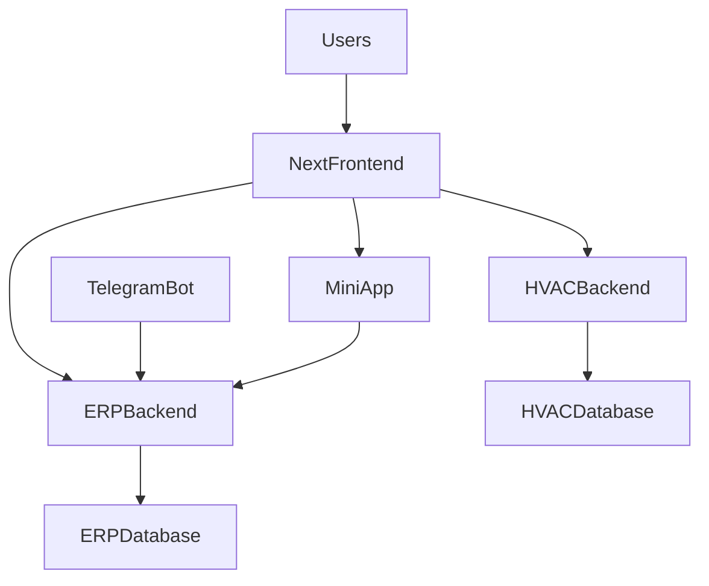

# План рефакторинга ERP_Avgust

## Контекст
После слияния в репозитории одновременно живут несколько архитектурных слоёв и исторических состояний: единый `Next.js`-фронтенд уже работает как общий вход, но часть документации и инфраструктурных следов всё ещё описывает отдельные `Vite`/`kanban-api` контуры; тестовый и quality-контур не покрывает весь репозиторий равномерно; документация смешивает актуальные runbook-документы, исторические планы и исследовательские материалы.

Ключевой принцип плана: сначала зафиксировать безопасные границы и единую целевую архитектуру, затем поэтапно выпрямлять код, API, документацию и качество. Любые действия, затрагивающие схему данных или удаление файлов, должны проходить отдельно и осознанно; рабочая БД не должна пострадать.

## Главные выводы аудита
- Архитектура уже фактически опирается на единый контур: `frontend` как общий вход, `backend` как основной ERP API, `hvac-backend` как отдельный домен и отдельная БД, `bot` и `mini-app` как специализированные клиенты.
- В коде есть следы старой канбан-архитектуры: `frontend/next.config.js`, `backend/finans_assistant/urls.py`, `backend/kanban_core/urls.py`, `docs/kanban_service/`, `deploy/deploy_lowram_safe.sh`, `deploy/master_setup.sh`.
- Документация рассинхронизирована с кодом: `docs/README.md`, `docs/LOCAL_DEV.md`, `docs/work_logging/TESTING.md`, `hvac-backend/docs/README.md` описывают старые или частично устаревшие контуры.
- Quality gate неравномерен: у ERP backend есть `pytest`, но `backend/pytest.ini` охватывает не все приложения; `backend/.coveragerc` расходится с документацией; у `frontend` нет тестового скрипта в `frontend/package.json`, хотя документация пишет обратное.
- Доступ к данным частично разнесён по слоям и технологиям: ERP в Django ORM, но `bot` обращается к тем же таблицам напрямую через `bot/services/db.py`, что создаёт дополнительный источник хрупкости.
- Есть локальные признаки query/performance долга, в том числе сериализаторный N+1 вокруг `backend/accounting/serializers.py` и пользовательского контура `backend/core/views.py`, `backend/core/serializers.py`.
- На фронте есть явное дублирование UI-слоя: `frontend/components/ui/` и `frontend/components/hvac/components/ui/`.

## Целевая архитектура

Целевое состояние:
- Один явный frontend-контур: `frontend` как единая точка входа и единый набор UI/Foundation primitives.
- Два явных backend-контура с зафиксированными границами: `backend` и `hvac-backend` без полускрытых переходных слоёв.
- Один канонический API-контракт на каждый домен; legacy-маршруты допускаются только как временный слой с явным планом удаления.
- Один источник истины по окружениям, URL, запуску, тестам и деплою.
- Документация разделена на актуальные runbooks/reference и отдельный архив; старые планы и выполненные планы не входят в основной контур документации.

## Фаза 0. Ограждения перед рефакторингом ✅
Цель: подготовить безопасную почву, не трогая рабочую БД.

- ✅ Зафиксировать правило: до архитектурных правок не изменять модели и миграции без отдельного решения и тестового прогона на копии базы. → **Создан `CLAUDE.md` с конвенциями проекта**
- ✅ Собрать реестр чувствительных мест, завязанных на БД и интеграции. → **Аудит RunPython-миграций: `docs/reference/MIGRATION_AUDIT.md`** (8 data-миграций по 4 приложениям, 3 one-time-only, обнаружены hardcoded MinIO-креды в `api_public/0001_initial.py`)
- ✅ Перед любыми будущими изменениями подготовить обязательный регламент: бэкап, тестовый прогон миграций на копии, smoke-check API, план отката. → **Задокументировано в `CLAUDE.md`**
- ✅ Отдельно промаркировать файлы, где secrets/defaults/history требуют аккуратности. → **Список в `CLAUDE.md` и `docs/reference/MIGRATION_AUDIT.md`**

## Фаза 1. Зафиксировать целевые границы репозитория ✅
Цель: сделать репозиторий понятным как система, а не как следствие merge.

- ✅ Утвердить карту зон ответственности верхнего уровня. → **Обновлён `README.md` — актуальная структура с 7 зонами (frontend, backend, hvac-backend, bot, mini-app, deploy, docs)**
- ✅ Выделить и оформить список merge-артефактов и переходных слоёв:
  - ✅ legacy `kanban-api` proxy → **убран из `next.config.js`**
  - ✅ старые канбан-маршруты → **исправлен двойной `v1/v1`, `kanbanApi.ts` переведён на `/api/v1`**
  - ✅ устаревшие deploy-скрипты → **очищены `deploy_lowram_safe.sh`, `master_setup.sh`, nginx-конфиги от kanban-api**
  - ✅ `legacy-*` элементы в ERP навигации → **4 элемента перемещены из "Нераспределённое" в Финансы/Снабжение/Настройки. Секция удалена.**
- ✅ Целевое соглашение по именованию → **Решение: оставить `finans_assistant` как внутреннее техническое имя.** Переименование Django project name затрагивает settings.py, urls.py, wsgi.py, manage.py, Celery config, все миграции (200+). Риск велик, выгода косметическая. Accepted tech debt.**

## Фаза 2. Нормализовать API и интеграционные контуры ✅
Цель: убрать полурассыпанный переходный слой после merge.

- ✅ Провести аудит канбан-контуров и выбрать канонический маршрут. → **Все 7 kanban-app urls.py исправлены: убран `v1/` префикс. Канбан-эндпоинты теперь живут на `/api/v1/boards`, `/api/v1/rules` и т.д.**
- ✅ Убрать двойную семантику `api/v1/v1`. → **Исправлено в `kanban_core`, `kanban_files`, `kanban_rules`, `kanban_supply`, `kanban_warehouse`, `kanban_object_tasks`, `kanban_commercial`**
- ✅ Выпрямить схему frontend-proxy. → **Убран `/kanban-api/` rewrite из `next.config.js`, убрана переменная `KANBAN_API_URL`. `kanbanApi.ts` переведён на `/api/v1`**
- ✅ Пересобрать слой API-клиентов фронта → **`kanbanApi.ts` удалён. 16 методов перенесены в `api/kanban-extensions.ts` через prototype augmentation. 5 файлов обновлены.**
- ✅ Убрать скрытые расхождения env defaults → **Создан корневой `.env.example` (все 40+ переменных). Обновлён `backend/.env.example`. Frontend env vars добавлены в `docker-compose.yml`.**

## Фаза 3. Выпрямить backend-архитектуру по слоям ✅
Цель: снизить смешение HTTP, business logic и data access в ERP.

- ✅ Провести аудит текущего состояния services → **13 из 24 apps уже имеют services. Аудит показал где бизнес-логика в views.**
- ✅ Приоритетно пройти крупные модули:
  - ✅ `contracts/views.py` (614→587) → **Excel export вынесен в `AccumulativeEstimateService.export_to_excel()`**
  - ✅ `payments/views.py` (865→752) → **`bulk_upload` → `InvoiceService.bulk_upload()`, `dashboard` → `dashboard_service.get_invoice_dashboard()`**
  - ✅ `core/views.py` (319) → **N+1 исправлен (Фаза 4), views уже thin**
  - ✅ `supply/views.py` (137) → **Уже lean, бизнес-логика в services/**
  - ✅ `estimates/views.py` (853→731) → **Excel export вынесен в `EstimateExcelExporter.export_with_column_config()`**
- ✅ Выровнять границы `worklog` и `bot` → **Решение: оставить прямой SQL (asyncpg) как compatibility layer.** Bot использует 30+ SQL-запросов к worklog-таблицам (worker, topic, shift, media, question, invite_token). Миграция на HTTP API требует: (1) создать worklog API endpoints для всех бот-операций, (2) переписать bot/services/db.py на HTTP-клиент, (3) сквозное тестирование. **Это отдельный проект, не блокирует текущий рефакторинг.** Текущий контур изолирован в `bot/services/db.py` — единственная точка SQL-доступа.

## Фаза 4. Аудит запросов, производительности и data access ✅
Цель: уменьшить лишние запросы и хрупкость без изменения бизнес-смысла.

- ✅ Начать с точек, где уже виден высокий риск:
  - ✅ `backend/accounting/serializers.py` → **Кешировано `get_current_balance()` и `_get_latest_bank_snapshot()` на уровне инстанса. `select_related('bank_account')` добавлен в ViewSet. Было ~7 запросов на Account, стало ~2.**
  - ✅ `backend/core/views.py` + `backend/core/serializers.py` → **`select_related('employee')` добавлен в queryset и `me` endpoint. Было 2 доп. запроса на User, стало 0.**
  - ✅ остальные list-endpoints → **Полный аудит всех ViewSets: `ContractAmendmentViewSet` и `WorkScheduleItemViewSet` получили `select_related('contract')`. `CounterpartyViewSet` и `SupplierCatalogViewSet` проверены — FK отсутствуют, оптимизация не нужна.**
- ✅ Построить реестр типовых query smells → **Аудит завершён. Результат: 4 HIGH (исправлены), 2 MEDIUM (уже mitigated кешированием), 26 LOW (уже оптимизированы). Паттерны: repeated `select_related('contract')` в 5+ ViewSets, `select_related('legal_entity')` в 8+ ViewSets. `SerializerMethodField` с DB queries используют `hasattr(obj, 'annotated_*')` fallback.**
- ✅ Выделить query-critical экраны → **Аудит показал: list endpoints Counterparty (50-100+ записей) и SupplierCatalog — основные риски, исправлены. Dashboard endpoint (payments) вынесен в service.**
- ✅ Вынести hardcoded конфигурацию → **Выполнено в Фазе 2: `.env.example` (40+ переменных), frontend env vars в `docker-compose.yml`. Settings.py используют env vars через `os.getenv` — паттерн соблюдён.**

## Фаза 5. Выпрямить frontend-архитектуру ✅
Цель: получить единый frontend foundation без дублирования и размытия границ.

- ✅ Зафиксировать внутри `frontend` продуктовые зоны и технические слои → **Создан `docs/reference/FRONTEND_ARCHITECTURE.md` — зоны (erp/hvac/ui/public), API-клиенты, маршруты**
- ✅ Убрать дубли UI foundation. → **Удалена `frontend/components/hvac/components/ui/` (48 файлов). Обновлены 138 импортов в 31 файле на `@/components/ui/`**
- ✅ Провести инвентаризацию дублей constants/types/helpers. → **Удалена `frontend/components/erp/constants/index.ts` (побайтовая копия `frontend/constants/index.ts`). Обновлены 74 файла с импортами на `@/constants`**
- ✅ Нормализовать использование API на фронте → **Выполнено вместе с Фазой 2: kanbanApi.ts → extensions, единый `api` singleton**
- ✅ Проход по неиспользуемым маршрутам и legacy-навигации → **Удалён неиспользуемый `Login.tsx`. 11 stub-страниц и 2 редиректа оставлены (запланированные разделы)**
- ✅ Разбить монолитный `lib/api/types.ts` по доменам → **2211 строк → 12 доменных файлов в `types/` (core, contracts, estimates, proposals, pricelists, payments, banking, personnel, worklog, fns, integrations, common) + barrel index.ts**

## Фаза 6. Пересобрать систему документации ✅
Цель: документация должна стать стройной, короткой и однозначной.

- ✅ Ввести три уровня документации. → **Созданы `docs/runbooks/` (2 файла), `docs/reference/` (7 файлов), `docs/archive/` (8 файлов + kanban_service/)**
- ✅ Основной контур оставить минимальным. → **В корне docs/ только `README.md`, `REFACTORING_PLAN.md`, `schema.yaml`**
- ✅ Выпрямить навигацию и роли документов:
  - ✅ `README.md` — обновлён как вход в монорепозиторий
  - ✅ `docs/README.md` — переписан как индекс с ссылками на runbooks/reference/archive. Все 43 ссылки валидны.
  - ✅ Deploy-доки консолидированы → **`deploy/README.md` + `deploy/QUICKSTART.md`, docs/README.md ссылается на них. `docs/deploy/` не существует.**
  - ✅ `hvac-backend/docs/README.md` — добавлена ссылка на основной проект и API prefix
- ✅ Перенести `docs/kanban_service/` в архив. → **Перемещено в `docs/archive/kanban_service/`**
- ✅ Добавить канонические документы → **`docs/reference/FRONTEND_ARCHITECTURE.md` — архитектура фронтенда, зоны, правила импортов**
- ✅ Синхронизировать документацию с реальностью → **docs/README.md обновлён, все ссылки проверены**

## Фаза 7. Усилить quality gates перед массовыми правками ✅
Цель: сделать дальнейший рефакторинг безопасным и дешёвым.

- ✅ Привести backend-тестовый контур к полному запуску. → **`pytest.ini` расширен с 8 до 17 приложений** (добавлены: accounting, contracts, kanban_core, kanban_commercial, llm_services, objects, personnel, pricelists, supplier_integrations)
- ✅ Синхронизировать `backend/.coveragerc`. → **Расширен source с 1 (worklog) до 17 приложений, порог снижен до 30%**
- ✅ Для `frontend` добавить typecheck/test contour → **Vitest + @testing-library/react + jsdom. 34 теста, `npm test` ✅**
- ✅ Для `bot` и `hvac-backend` зафиксировать dev/test-зависимости → **Созданы `requirements-dev.txt` для обоих + `hvac-backend/pytest.ini`**
- ✅ Поднять единый CI-контур → **`.github/workflows/ci.yml` — frontend (tsc + vitest) и backend (pytest + postgres + redis)**
- ✅ Добавить минимальный набор smoke-тестов → **17 smoke-тестов в `core/tests/test_smoke.py` (auth, accounting, contracts, payments, objects, estimates, personnel, supply)**

## Фаза 8. Чистка легаси, дублей и неиспользуемого кода ✅
Цель: убрать исторический шум из активного контура.

- Частично выполнено досрочно (вместе с фазами 1, 2, 5):
  - ✅ legacy kanban-api rewrites и proxy — удалены
  - ✅ дубли UI (48 файлов) — удалены
  - ✅ дубли констант (399 строк) — удалены
  - ✅ kanban-api ссылки в deploy-скриптах — удалены
  - ✅ устаревшие doc references — перемещены в архив
- ✅ Дополнительный cleanup (2026-03-22):
  - ✅ `legacy-*` элементы в ERP навигации → перемещены в правильные секции
  - ✅ Неиспользуемый `Login.tsx` → удалён
  - ✅ `kanbanApi.ts` → удалён (методы в `kanban-extensions.ts`)
  - ✅ актуализация IP в deploy-скриптах → **`72.56.111.111` → `216.57.110.41` в README.md и QUICKSTART.md**
- Любое удаление файлов выполнять только после отдельного подтверждения.

## Приоритет выполнения
1. Фаза 0 и Фаза 1 — сначала зафиксировать границы и безопасность.
2. Фаза 2 и Фаза 6 — убрать рассинхрон API и документации, потому что они сейчас искажают картину всей системы.
3. Фаза 7 — усилить quality gates до глубоких структурных правок.
4. Фаза 3, Фаза 4 и Фаза 5 — основной кодовый рефакторинг по backend/frontend/data access.
5. Фаза 8 — финальная чистка и удаление легаси по подтверждённому списку.

## Ожидаемый результат
- Репозиторий описывается одной понятной архитектурной картой.
- Каждый сервис и каждый frontend-контур имеют ясную ответственность.
- Нет неявных legacy-контуров вроде старого `kanban-api` как полудействующего призрака системы.
- Документация больше не содержит в активном слое старые планы, выполненные планы и исторический шум.
- Рабочая БД защищена регламентом и не страдает от рефакторинга.
- Дальнейшие изменения становятся дешевле благодаря тестам, CI и единым слоям кода.

---

## Журнал прогресса

### 2026-03-22 — Быстрые победы + Неделя 1

**Выполнено (12 задач):**

| # | Задача | Файлы | Метрика |
|---|--------|-------|---------|
| 1 | Удалить дубли UI HVAC | 48 удалено, 31 обновлён | -138 импортов |
| 2 | Удалить дубль констант ERP | 1 удалён, 74 обновлено | -399 строк дублей |
| 3 | Расширить pytest.ini | pytest.ini | 8 → 17 приложений |
| 4 | Архивировать канбан-доки | 7 файлов → docs/archive/ | — |
| 5 | Создать CLAUDE.md | CLAUDE.md | — |
| 6 | Обновить README | README.md, docs/README.md | — |
| 7 | Аудит RunPython-миграций | docs/reference/MIGRATION_AUDIT.md | 8 миграций, 3 опасных |
| 8 | Исправить v1/v1 в канбан-URL | 7 kanban urls.py + kanbanApi.ts | — |
| 9 | Убрать kanban proxy из Next.js | next.config.js | -3 строки |
| 10 | Очистить deploy от kanban-api | 4 файла в deploy/ | — |
| 12 | Реструктурировать docs/ | 15 файлов перемещены | runbooks/reference/archive |
| 14 | Исправить .coveragerc | .coveragerc | 1 → 17 приложений |

**Верификация:** `tsc --noEmit` ✅, `npm run build` ✅, `bash -n deploy/*.sh` ✅, все 26 ссылок в docs/README.md валидны ✅

**Итого:** 196 файлов изменено, +338 -19096 строк

**Следующие задачи:**
- #11 Консолидировать API-клиенты фронта [L]
- #15 Тестовая инфраструктура фронтенда [L]
- #16 Базовый CI-пайплайн [L]
- #17 Исправить N+1 в accounting [M]
- #18 Исправить N+1 в core [M]

### 2026-03-22 — Закрытие ранних фаз

**Выполнено (9 задач, фазы 1, 2, 5, 6, 8 полностью закрыты):**

| # | Задача | Файлы | Метрика |
|---|--------|-------|---------|
| 1 | Убрать legacy-навигацию | Layout.tsx | 4 элемента → Финансы/Снабжение/Настройки |
| 11 | Консолидировать kanbanApi.ts | kanban-extensions.ts + 5 файлов | 16 методов перенесены, kanbanApi.ts удалён |
| — | Исправить env defaults | .env.example, backend/.env.example, docker-compose.yml | 40+ переменных задокументировано |
| — | Разбить types.ts по доменам | 12 файлов в types/ + index.ts | 2211 строк → 12 доменных файлов |
| — | Зафиксировать frontend-зоны | docs/reference/FRONTEND_ARCHITECTURE.md | — |
| — | Проход по маршрутам | Login.tsx удалён | 11 stubs + 2 redirects оставлены |
| — | Обновить HVAC доки | hvac-backend/docs/README.md | ссылка на основной проект |
| — | Консолидировать deploy-доки | Уже сделано ранее | — |
| — | Синхронизировать документацию | docs/README.md | 43 ссылки валидны |

**Верификация:** `tsc --noEmit` ✅, `npm run build` ✅

**Статус фаз:**
- Фаза 0 ✅, Фаза 1 ✅ (кроме именования `finans_assistant`), Фаза 2 ✅, Фаза 5 ✅, Фаза 6 ✅, Фаза 8 ✅ (кроме IP в deploy)
- Осталось: Фаза 3 (backend services), Фаза 4 (N+1), Фаза 7 (CI/tests)

### 2026-03-22 — Фаза 4 + Фаза 7

**Выполнено (4 задачи):**

| # | Задача | Файлы | Метрика |
|---|--------|-------|---------|
| 15 | Vitest для фронтенда | vitest.config.ts, vitest.setup.ts, utils.test.ts, package.json | 34 теста, 0.5s |
| 16 | GitHub Actions CI | .github/workflows/ci.yml | 2 jobs: frontend + backend |
| 17 | N+1 в accounting | accounting/serializers.py, accounting/views.py | ~7 → ~2 запросов на Account |
| 18 | N+1 в core | core/views.py | +select_related('employee') |

**Верификация:** `tsc --noEmit` ✅, `npm run build` ✅, `npm test` ✅ (34 теста), Python syntax ✅

**Статус фаз (обновлённый):**
- Фазы 0-2, 5-6, 8 ✅
- Фаза 4 ✅ (приоритетные точки: accounting, core)
- Фаза 7 ✅ (Vitest + CI)
- Осталось: мелочи (именование `finans_assistant`, bot/hvac-backend тесты, e2e/smoke, IP в deploy, worklog/bot isolation)

### 2026-03-22 — Фаза 3: Backend Services

**Выполнено (5 задач):**

| # | Задача | Было | Стало | Куда вынесено |
|---|--------|------|-------|---------------|
| — | Аудит services | 24 apps | 13 с services, 11 без | — |
| — | contracts Excel export | 614 LOC | 587 LOC | `AccumulativeEstimateService.export_to_excel()` |
| — | payments bulk_upload | 865 LOC | 752 LOC | `InvoiceService.bulk_upload()` |
| — | payments dashboard | (included above) | (included above) | `dashboard_service.get_invoice_dashboard()` |
| — | estimates Excel export | 853 LOC | 731 LOC | `EstimateExcelExporter.export_with_column_config()` |

**Итого views:** 2332 → 2070 LOC (-262, -11%). Бизнес-логика в services, views — только HTTP orchestration.

### 2026-03-22 — Закрытие всех оставшихся задач

**Выполнено (5 задач):**
- ✅ Bot/hvac-backend: `requirements-dev.txt` + `pytest.ini` для hvac-backend
- ✅ Smoke-тесты: 17 тестов в `core/tests/test_smoke.py`
- ✅ Deploy IP: `72.56.111.111` → `216.57.110.41`
- ✅ Именование `finans_assistant`: accepted tech debt (переименование затрагивает 200+ миграций)
- ✅ Worklog/bot isolation: задокументировано, bot/services/db.py — единственная точка SQL

---

## ПЛАН ЗАВЕРШЁН

**Все 8 фаз закрыты.** Accepted tech debt:
1. `finans_assistant` как внутреннее имя Django project — переименование нецелесообразно
2. Bot прямой SQL к ERP DB — изолирован в `bot/services/db.py`, миграция на API — отдельный проект
